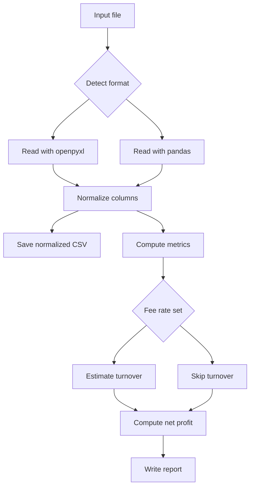

## bingx-report-tool

A small CLI to convert exchange exports (CSV/XLSX, including misnamed CSV with ZIP header) into a normalized UTF-8 CSV and compute key futures trading metrics.

- Normalize export to a consistent schema
- Compute Trading Fees, Funding Fees, Realized PnL
- Estimate Turnover from Trading Fees and a given fee rate
- Compute Net Profit in USDT and as % of Turnover
- Output normalized CSV and a human-readable report

Repository: [suenot/bingx-report-tool](https://github.com/suenot/bingx-report-tool)

### Install

Requirements: Python 3.10+

```bash
pip install -r requirements.txt
```

### Quick Start

```bash
python3 tools/trade_report.py /absolute/path/to/export.csv --fee-rate 0.0006
```

Outputs (next to input):
- `<name>.normalized.csv`
- `<name>.report.txt`

### CLI

```
usage: trade_report.py [-h] [--normalized-csv NORMALIZED_CSV] [--report REPORT] [--fee-rate FEE_RATE] input

Convert exchange export to normalized CSV and compute fees/turnover

positional arguments:
  input                 Path to input file (.csv or .xlsx; misnamed .csv with PK header is auto-detected)

options:
  -h, --help            show this help message and exit
  --normalized-csv NORMALIZED_CSV
                        Path to write normalized CSV (UTF-8)
  --report REPORT       Path to write text report
  --fee-rate FEE_RATE   Trading fee rate (e.g., 0.0006). Used to estimate turnover from fees.
```

### Data Model

Canonical columns: `time,type,details,amount,asset,symbol,note`.
`amount` is numeric; `time` is preserved as text and parsed into `time_parsed` if possible.

### Formulas

- Turnover ≈ `abs(Trading Fee) / fee_rate`
- Net Profit (USDT) = `Realized PnL − (|Trading Fee| + |Funding Fee|)`
- Net Profit (%) = `Net Profit / Turnover × 100` (requires `--fee-rate`)

### Flow



### Example

```bash
python3 tools/trade_report.py /data/export_2025-08-08.csv --fee-rate 0.0006
```

### Notes

- Turnover from fees is an estimate; use the effective blended fee rate.
- For per-day aggregation or custom symbol mapping, extend `tools/trade_report.py`.


